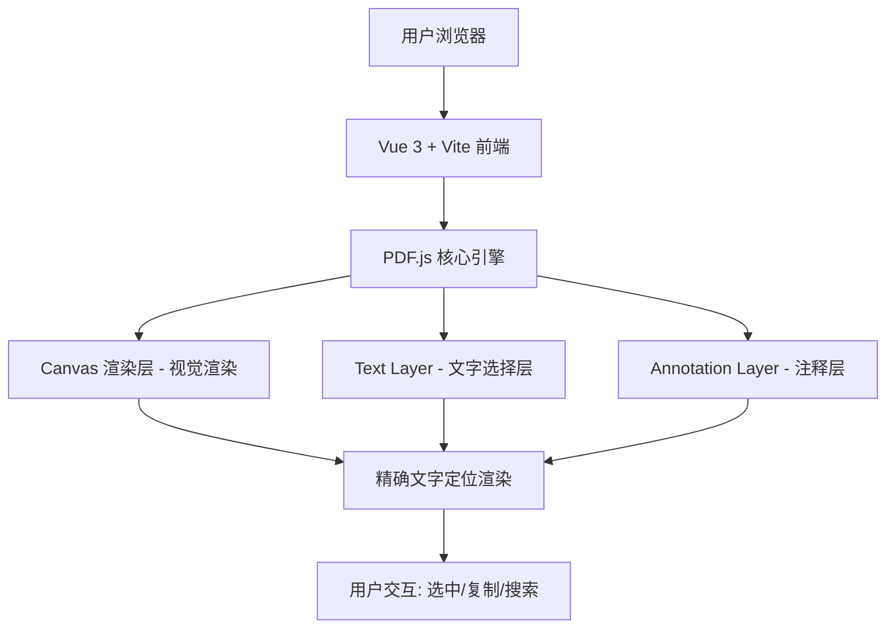

# PDF Viewer 项目设计文档

## 系统架构



## 技术方案

### 核心：PDF.js Text Layer

PDF.js 提供三层渲染架构：
1. **Canvas Layer**: 将 PDF 页面渲染为位图，提供视觉效果
2. **Text Layer**: 在 Canvas 上方叠加透明文本 DOM 元素，每个文字 span 的位置、大小、旋转角度与 Canvas 中的文字像素级对齐
3. **Annotation Layer**: 处理链接、表单等交互元素

Text Layer 是实现"选中 PDF 文字如同选中 HTML 文字"的关键。PDF.js 会解析 PDF 中每个文字的精确坐标、字体大小、旋转角度，生成对应的 `<span>` 元素并精确定位。

### 技术栈

- Vue 3 + Vite + TypeScript
- pdfjs-dist (PDF.js 官方 npm 包)
- SCSS
- Docker + Nginx (部署)

## UI/UX 规范

| 项目 | 值 |
|------|-----|
| 主色调 | #1677ff (蓝) |
| 背景色 | #f0f2f5 (浅灰) |
| 卡片背景 | #ffffff |
| 卡片圆角 | 8px |
| 卡片阴影 | 0 2px 8px rgba(0,0,0,0.08) |
| 字体 | -apple-system, BlinkMacSystemFont, 'Segoe UI', Roboto, sans-serif |
| 正文字号 | 14px |
| 标题字号 | 18px |
| 间距基数 | 8px (8/16/24/32) |

## 页面结构

```
┌─────────────────────────────────────────────┐
│  顶部工具栏 (文件名 | 页码 | 缩放 | 操作)    │
├─────────────────────────────────────────────┤
│                                             │
│           PDF 渲染区域                       │
│     (Canvas + TextLayer 叠加)               │
│                                             │
│                                             │
└─────────────────────────────────────────────┘
```
